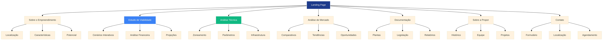

# Planejamento Estruturado para Site de Estudo de Viabilidade
## Empreendimento Imobiliário - Gravataí/RS

**Cliente:** Propor Engenharia (propor.eng.br)  
**Responsável Técnico:** Rodrigo Emanuel Rabello - Engenheiro Civil  
**Data:** Junho de 2025  

---

## 1. ANÁLISE DOS ARQUIVOS EXISTENTES

### 1.1 Situação Atual do Projeto

Com base na análise dos arquivos fornecidos, identificamos que a Propor Engenharia já possui duas páginas desenvolvidas para apresentar o estudo de viabilidade do empreendimento localizado na Rua Vicinal Junção, Bairro Santa Fé, Gravataí/RS. O projeto demonstra um trabalho técnico sólido e bem fundamentado, com análise detalhada de mercado e conformidade com a legislação municipal.

#### Páginas Existentes:
1. **Análise Interativa de Viabilidade** (`estudo_viabilidade.html`)
2. **Painel de Zoneamento Urbano** (`link_zoneamento.html`)

### 1.2 Características do Terreno

**Dados Cadastrais (BCI):**
- Inscrição Imobiliária: 01.03.210.0203
- Endereço: Rua Vicinal Junção, 275 - Bairro Otávio Bazotti
- Área do Lote: 6.132,50 m²
- Testada Principal: 54,20 m
- Profundidade: 113,15 m

**Enquadramento Legal:**
- Zona de Adensamento 5 - Sub-zona V
- Área de uso misto permitido (residencial e comercial)
- Macrozona de ocupação prioritária
- Lotes com área mínima de 180m²
- Índice de aproveitamento: 1,2
- Taxa de Ocupação: 60%

### 1.3 Análise das Páginas Existentes

#### Página 1: Análise Interativa de Viabilidade
**Pontos Fortes:**
- Interface moderna e responsiva usando Tailwind CSS
- Três cenários de desenvolvimento bem estruturados
- Gráficos interativos com Chart.js
- Análise de mercado fundamentada em dados reais
- Transparência com fontes de dados
- Análise SWOT e plano de ação

**Estrutura Atual:**
1. Painel de Controle do Investidor
2. Análise de Mercado
3. Fontes de Dados e Tabelas
4. Análise Estratégica (SWOT)
5. Plano de Ação

#### Página 2: Painel de Zoneamento Urbano
**Pontos Fortes:**
- Design clean e profissional
- Sistema de filtros interativo
- Links organizados por categoria
- Timeline visual da evolução do Plano Diretor
- Informações sobre órgãos responsáveis

**Estrutura Atual:**
1. Visão geral do Plano Diretor
2. Acesso às fontes de informação
3. Evolução e revisão do Plano Diretor
4. Identificação dos atores principais

---

## 2. ESTRUTURAÇÃO DO PLANEJAMENTO DA PÁGINA

### 2.1 Objetivos do Site

#### Objetivo Principal
Criar uma plataforma digital profissional que apresente de forma clara e convincente o estudo de viabilidade do empreendimento imobiliário em Gravataí, demonstrando a expertise técnica da Propor Engenharia e fornecendo informações completas para tomada de decisão de investidores.

#### Objetivos Específicos
1. **Credibilidade Técnica:** Estabelecer a Propor Engenharia como referência em estudos de viabilidade
2. **Transparência:** Apresentar dados, fontes e metodologia de forma clara
3. **Facilidade de Navegação:** Permitir acesso rápido às informações relevantes
4. **Suporte à Decisão:** Fornecer ferramentas interativas para análise de cenários
5. **Conformidade Legal:** Demonstrar adequação às normas municipais

### 2.2 Público-Alvo

#### Primário
- **Investidores Imobiliários:** Interessados em oportunidades de desenvolvimento
- **Construtoras e Incorporadoras:** Buscando terrenos para projetos
- **Fundos de Investimento:** Avaliando ativos imobiliários

#### Secundário
- **Corretores de Imóveis:** Necessitando informações técnicas
- **Consultores Financeiros:** Assessorando clientes em investimentos
- **Órgãos Públicos:** Verificando conformidade com normas

### 2.3 Arquitetura da Informação Proposta

#### Estrutura Hierárquica Principal

**1. HOME/LANDING PAGE**
- Apresentação da Propor Engenharia
- Resumo executivo do projeto
- Call-to-action para áreas específicas

**2. SOBRE O EMPREENDIMENTO**
- Localização e características do terreno
- Potencial construtivo
- Diferenciais competitivos

**3. ESTUDO DE VIABILIDADE** (Página existente aprimorada)
- Análise financeira interativa
- Cenários de desenvolvimento
- Projeções de retorno

**4. ANÁLISE TÉCNICA**
- Conformidade legal e zoneamento
- Parâmetros urbanísticos
- Infraestrutura disponível

**5. ANÁLISE DE MERCADO**
- Comparativos de preços
- Tendências do setor
- Oportunidades identificadas

**6. DOCUMENTAÇÃO**
- Plantas e mapas
- Legislação aplicável
- Relatórios técnicos

**7. SOBRE A PROPOR ENGENHARIA**
- Histórico e expertise
- Equipe técnica
- Projetos realizados

**8. CONTATO**
- Informações para contato
- Formulário de interesse
- Localização do escritório

### 2.4 Fluxo de Navegação

#### Jornada do Usuário Tipo (Investidor)
1. **Entrada:** Landing page com resumo atrativo
2. **Interesse:** Navegação para estudo de viabilidade
3. **Análise:** Exploração dos cenários interativos
4. **Validação:** Consulta à documentação técnica
5. **Decisão:** Acesso às informações de contato
6. **Ação:** Preenchimento de formulário ou contato direto

#### Pontos de Conversão
- Botões de "Solicitar Apresentação"
- Downloads de materiais técnicos
- Formulários de contato qualificado
- Links para agendamento de reunião

---

## 3. ESPECIFICAÇÕES TÉCNICAS

### 3.1 Tecnologias Recomendadas

#### Frontend
- **HTML5/CSS3:** Estrutura semântica e estilização
- **Tailwind CSS:** Framework CSS para design responsivo
- **JavaScript ES6+:** Interatividade e funcionalidades dinâmicas
- **Chart.js:** Gráficos e visualizações de dados
- **AOS (Animate On Scroll):** Animações suaves

#### Recursos Adicionais
- **Google Fonts:** Tipografia profissional (Inter)
- **Font Awesome:** Ícones vetoriais
- **Leaflet.js:** Mapas interativos (se necessário)
- **PDF.js:** Visualização de documentos

### 3.2 Requisitos de Performance

#### Otimização
- Carregamento inicial < 3 segundos
- Imagens otimizadas (WebP quando possível)
- CSS e JS minificados
- Lazy loading para conteúdo não crítico

#### Responsividade
- Design mobile-first
- Breakpoints: 320px, 768px, 1024px, 1440px
- Touch-friendly para dispositivos móveis
- Testes em múltiplos dispositivos

### 3.3 SEO e Acessibilidade

#### SEO
- Meta tags otimizadas
- Schema markup para dados estruturados
- URLs semânticas
- Sitemap XML

#### Acessibilidade
- Conformidade WCAG 2.1 AA
- Navegação por teclado
- Alt text para imagens
- Contraste adequado de cores

---

## 4. DESIGN E IDENTIDADE VISUAL

### 4.1 Paleta de Cores

#### Cores Primárias
- **Azul Corporativo:** #1e3a8a (confiança, profissionalismo)
- **Cinza Escuro:** #1f2937 (elegância, seriedade)
- **Branco:** #ffffff (clareza, limpeza)

#### Cores Secundárias
- **Azul Claro:** #3b82f6 (destaque, interatividade)
- **Cinza Médio:** #6b7280 (texto secundário)
- **Verde:** #10b981 (sucesso, crescimento)
- **Amarelo:** #f59e0b (atenção, destaque)

### 4.2 Tipografia

#### Fonte Principal
- **Inter:** Moderna, legível, profissional
- Pesos: 400 (regular), 500 (medium), 600 (semibold), 700 (bold)

#### Hierarquia Tipográfica
- **H1:** 3rem (48px) - Títulos principais
- **H2:** 2.25rem (36px) - Títulos de seção
- **H3:** 1.5rem (24px) - Subtítulos
- **Body:** 1rem (16px) - Texto corrido
- **Small:** 0.875rem (14px) - Texto auxiliar

### 4.3 Elementos Visuais

#### Componentes
- Cards com sombras suaves
- Botões com estados hover/active
- Formulários com validação visual
- Modais para conteúdo detalhado
- Tooltips informativos

#### Iconografia
- Ícones consistentes (Font Awesome)
- Tamanhos padronizados
- Cores alinhadas com a paleta

---

## 5. CONTEÚDO E COPYWRITING

### 5.1 Tom de Voz

#### Características
- **Profissional:** Linguagem técnica quando necessário
- **Confiável:** Dados e fontes sempre citados
- **Acessível:** Explicações claras para não especialistas
- **Persuasivo:** Foco nos benefícios e oportunidades

### 5.2 Estrutura de Conteúdo por Seção

#### Landing Page
- **Headline:** "Oportunidade Única de Investimento em Gravataí"
- **Subheadline:** Resumo do potencial do empreendimento
- **Benefícios:** Lista dos principais atrativos
- **Social Proof:** Credenciais da Propor Engenharia

#### Estudo de Viabilidade
- **Introdução:** Metodologia e premissas
- **Cenários:** Descrição detalhada de cada opção
- **Análise Financeira:** VGV, TIR, payback
- **Riscos:** Identificação e mitigação

#### Análise Técnica
- **Zoneamento:** Explicação das normas aplicáveis
- **Parâmetros:** Índices e coeficientes
- **Infraestrutura:** Disponibilidade de serviços
- **Aprovações:** Processo e prazos

### 5.3 Call-to-Actions (CTAs)

#### Primários
- "Solicitar Apresentação Completa"
- "Agendar Reunião Técnica"
- "Baixar Estudo Detalhado"

#### Secundários
- "Saiba Mais Sobre o Projeto"
- "Conheça a Propor Engenharia"
- "Ver Documentação Técnica"

---

## 6. FUNCIONALIDADES INTERATIVAS

### 6.1 Calculadora de Cenários

#### Recursos
- Sliders para ajuste de parâmetros
- Atualização em tempo real dos resultados
- Comparação lado a lado de cenários
- Export de resultados em PDF

#### Parâmetros Ajustáveis
- Número de lotes
- Área média dos lotes
- Preço de venda por m²
- Custos de desenvolvimento
- Prazo de vendas

### 6.2 Mapa Interativo

#### Funcionalidades
- Localização do terreno
- Pontos de interesse próximos
- Camadas de zoneamento
- Medições de distância
- Street View integrado

### 6.3 Galeria de Documentos

#### Organização
- Categorização por tipo
- Sistema de busca
- Preview inline
- Download individual ou em lote
- Controle de versões

---

## 7. INTEGRAÇÃO COM SISTEMAS

### 7.1 CRM Integration

#### Funcionalidades
- Captura de leads qualificados
- Scoring automático de prospects
- Integração com pipeline de vendas
- Relatórios de conversão

### 7.2 Analytics

#### Métricas Importantes
- Tempo de permanência por seção
- Taxa de conversão por CTA
- Origem do tráfego
- Dispositivos mais utilizados
- Páginas mais acessadas

### 7.3 Comunicação

#### Canais
- Formulários de contato
- Chat online (se aplicável)
- WhatsApp Business
- E-mail marketing
- Newsletter técnica

---

## 8. CRONOGRAMA DE DESENVOLVIMENTO

### 8.1 Fase 1: Planejamento e Design (Semana 1-2)
- Aprovação do planejamento
- Criação de wireframes
- Design das páginas principais
- Definição da arquitetura técnica

### 8.2 Fase 2: Desenvolvimento Frontend (Semana 3-4)
- Estrutura HTML das páginas
- Implementação do CSS responsivo
- Desenvolvimento das funcionalidades JavaScript
- Integração dos gráficos e mapas

### 8.3 Fase 3: Conteúdo e Integração (Semana 5)
- Inserção do conteúdo final
- Otimização de imagens
- Testes de funcionalidade
- Integração com sistemas externos

### 8.4 Fase 4: Testes e Deploy (Semana 6)
- Testes em múltiplos dispositivos
- Validação de performance
- Correções finais
- Deploy em produção

---

## 9. MANUTENÇÃO E EVOLUÇÃO

### 9.1 Atualizações Regulares

#### Conteúdo
- Atualização de preços de mercado
- Novos comparativos
- Mudanças na legislação
- Progresso do projeto

#### Técnicas
- Atualizações de segurança
- Otimizações de performance
- Novos recursos
- Correções de bugs

### 9.2 Monitoramento

#### KPIs
- Número de visitantes únicos
- Taxa de conversão
- Tempo médio de sessão
- Páginas por sessão
- Taxa de rejeição

#### Relatórios
- Relatório mensal de analytics
- Análise de conversões
- Feedback dos usuários
- Sugestões de melhorias

---

## 10. ORÇAMENTO E RECURSOS

### 10.1 Estimativa de Desenvolvimento

#### Recursos Humanos
- Designer UX/UI: 40 horas
- Desenvolvedor Frontend: 60 horas
- Desenvolvedor Backend: 20 horas
- Redator/Copywriter: 16 horas
- Gerente de Projeto: 20 horas

#### Recursos Técnicos
- Hospedagem premium
- Domínio e SSL
- Ferramentas de analytics
- Licenças de software

### 10.2 ROI Esperado

#### Benefícios Quantificáveis
- Redução do tempo de apresentação
- Maior qualificação de leads
- Aumento da credibilidade
- Diferenciação competitiva

#### Benefícios Intangíveis
- Fortalecimento da marca
- Posicionamento como especialista
- Facilidade de atualização
- Escalabilidade para novos projetos

---

## CONCLUSÃO

O planejamento apresentado visa criar uma plataforma digital robusta e profissional que não apenas apresente o estudo de viabilidade do empreendimento em Gravataí, mas também posicione a Propor Engenharia como referência no mercado de consultoria imobiliária.

A estrutura proposta aproveita o excelente trabalho já desenvolvido nas duas páginas existentes, expandindo e organizando o conteúdo de forma a criar uma experiência completa e convincente para investidores e demais stakeholders.

A implementação seguirá as melhores práticas de desenvolvimento web, garantindo performance, acessibilidade e facilidade de manutenção, enquanto oferece funcionalidades interativas que agregam valor real ao processo de tomada de decisão dos usuários.

---

**Documento elaborado por:** Manus AI  
**Para:** Propor Engenharia - Rodrigo Emanuel Rabello  
**Data:** Junho de 2025  
**Versão:** 1.0

---

## ANEXO A: ESBOÇO VISUAL E ESTRUTURAL

### A.1 Arquitetura da Informação

O diagrama a seguir ilustra a estrutura hierárquica proposta para o site, mostrando a navegação principal e as subseções de cada área:

### A.2 Layout da Landing Page

#### Seções Principais:

**1. Header/Navegação**
- Logo da Propor Engenharia (posição superior esquerda)
- Menu horizontal responsivo
- Botão de contato destacado (CTA secundário)
- Design sticky para facilitar navegação

**2. Hero Section**
- Headline impactante com destaque para o valor do investimento
- Subheadline explicativa com dados-chave
- Dois CTAs principais: "Ver Estudo Completo" e "Agendar Apresentação"
- Card flutuante com destaques do projeto
- Gradiente azul corporativo como background

**3. Seção de Estatísticas**
- Quatro métricas principais em destaque
- Animação de contadores para engajamento
- Layout em grid responsivo
- Números grandes e impactantes

**4. Seção de Benefícios**
- Três cards principais com ícones
- Efeito hover com elevação
- Links para seções específicas
- Design clean e profissional

**5. Call-to-Action Final**
- Background azul escuro para contraste
- Dois botões de ação principais
- Texto persuasivo e direto
- Posicionamento estratégico antes do footer

**6. Footer**
- Informações da empresa
- Dados do responsável técnico
- Links para redes sociais
- Informações de contato completas

### A.3 Paleta de Cores Aplicada

#### Cores Primárias:
- **Azul Corporativo (#1e3a8a):** Headers, botões principais, elementos de destaque
- **Azul Claro (#3b82f6):** Gradientes, links, elementos interativos
- **Branco (#ffffff):** Backgrounds, texto em elementos escuros
- **Cinza Escuro (#1f2937):** Texto principal, elementos de contraste

#### Cores de Apoio:
- **Amarelo (#f59e0b):** CTAs principais, elementos de destaque
- **Verde (#10b981):** Indicadores positivos, ícones de sucesso
- **Cinza Médio (#6b7280):** Texto secundário, elementos sutis

### A.4 Tipografia e Hierarquia

#### Fonte Principal: Inter
- **H1 (Hero):** 4xl-6xl (48px-72px) - Bold
- **H2 (Seções):** 4xl (36px) - Bold  
- **H3 (Cards):** 2xl (24px) - Bold
- **Body Text:** xl (20px) - Regular
- **Small Text:** base (16px) - Medium

#### Aplicação:
- Headlines com peso bold para impacto
- Texto corrido com peso regular para legibilidade
- Elementos de destaque com peso semibold
- Hierarquia clara e consistente

### A.5 Elementos Interativos

#### Botões:
- **Primários:** Gradiente azul, hover com elevação
- **Secundários:** Outline branco, hover com preenchimento
- **Terciários:** Links azuis, hover com mudança de cor

#### Cards:
- Sombra sutil no estado normal
- Elevação e sombra maior no hover
- Transições suaves (0.3s ease)
- Bordas arredondadas para modernidade

#### Animações:
- Floating animation para elementos de destaque
- Counter animation para estatísticas
- Smooth scrolling para navegação
- Hover states em todos os elementos interativos

### A.6 Responsividade

#### Breakpoints:
- **Mobile:** 320px-767px (1 coluna)
- **Tablet:** 768px-1023px (2 colunas)
- **Desktop:** 1024px+ (3-4 colunas)

#### Adaptações:
- Menu hamburger em dispositivos móveis
- Stack vertical de CTAs em telas pequenas
- Redução de padding e margens proporcionais
- Imagens e ícones escaláveis

### A.7 Microinterações

#### Feedback Visual:
- Mudança de cor em hover
- Elevação de elementos clicáveis
- Loading states para formulários
- Confirmações visuais de ações

#### Transições:
- Duração padrão: 0.3s
- Easing: ease-in-out
- Propriedades: transform, opacity, color
- Performance otimizada (GPU acceleration)

### A.8 Acessibilidade

#### Conformidade WCAG 2.1:
- Contraste mínimo 4.5:1 para texto normal
- Contraste mínimo 3:1 para texto grande
- Navegação por teclado funcional
- Alt text descritivo para imagens
- Landmarks semânticos (header, main, footer)

#### Recursos Inclusivos:
- Focus indicators visíveis
- Texto escalável até 200%
- Cores não como única forma de informação
- Estrutura de headings lógica

### A.9 Performance

#### Otimizações:
- Imagens em formato WebP quando possível
- CSS e JS minificados
- Lazy loading para conteúdo não crítico
- CDN para recursos externos
- Compressão gzip habilitada

#### Métricas Alvo:
- First Contentful Paint: < 1.5s
- Largest Contentful Paint: < 2.5s
- Cumulative Layout Shift: < 0.1
- First Input Delay: < 100ms

### A.10 Integração com Páginas Existentes

#### Aproveitamento do Conteúdo:
- Página de viabilidade existente como seção principal
- Página de zoneamento integrada à análise técnica
- Manutenção da identidade visual estabelecida
- Reutilização de componentes funcionais

#### Melhorias Propostas:
- Navegação unificada entre todas as páginas
- Breadcrumbs para orientação do usuário
- Links contextuais entre seções relacionadas
- Consistência visual e funcional

---

## ANEXO B: EXEMPLO PRÁTICO - LANDING PAGE

Foi desenvolvido um exemplo prático da landing page proposta, demonstrando:

### Características Implementadas:
- Design responsivo com Tailwind CSS
- Animações e microinterações
- Paleta de cores corporativa
- Tipografia hierárquica
- CTAs estrategicamente posicionados
- Seções de conteúdo otimizadas
- Footer informativo completo

### Funcionalidades Demonstradas:
- Smooth scrolling para navegação
- Animação de contadores nas estatísticas
- Efeitos hover em cards e botões
- Layout responsivo para múltiplos dispositivos
- Integração com ícones Font Awesome
- Gradientes e efeitos visuais modernos

### Arquivo de Exemplo:
O arquivo `landing_page_exemplo.html` contém a implementação completa da landing page proposta, servindo como referência visual e técnica para o desenvolvimento final.

---

## CONSIDERAÇÕES FINAIS DO ESBOÇO

O esboço visual e estrutural apresentado demonstra como o planejamento teórico se traduz em uma implementação prática e profissional. A combinação de design moderno, funcionalidade robusta e foco na experiência do usuário cria uma base sólida para o sucesso do projeto.

A estrutura proposta é escalável e permite futuras expansões, mantendo sempre a coerência visual e funcional. O exemplo prático serve como prova de conceito e guia para a implementação final, garantindo que o resultado atenda às expectativas de qualidade e profissionalismo da Propor Engenharia.

